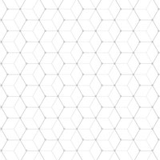

# Background

* [Background Color](#background-color)
* [Background Image](#background-image)
* [Background Repeat](#background-repeat)
* [Background Position](#background-position)
* [Background Attachment](#background-attachment)
* [Background Size](#background-size)
* [Background Blend Mode](#background-blend-mode)
* [Background Shorthand](#background)
* [Filter](#filter)
* [Opacity](#opacity)

## [Background Color](https://developer.mozilla.org/en-US/docs/Web/CSS/background-color)
---

> <b>Value:</b> `<color>`

### Syntax

```css
/* Keyword values */
background-color: red;
background-color: indigo;

/* Hexadecimal value */
background-color: #bbff00;    /* Fully opaque */
background-color: #11ffee00;  /* Fully transparent */
background-color: #11ffeeff;  /* Fully opaque */

/* RGB value */
background-color: rgb(255, 255, 128);        /* Fully opaque */
background-color: rgba(117, 190, 218, 0.5);  /* 50% transparent */

/* Special keyword values */
background-color: currentcolor;
background-color: transparent;
```

### Example

```css
h1 {
  background-color: #000;
  color: #fff;
  padding: 20px;
}
```

<div style="border-radius: 0.3rem;background-color: #f3f6fa;border: solid 1px #dce6f0; padding: 0.8rem;">
  <h1 style="background-color: #000; color: #fff; padding: 20px;">Lorem ipsum dolor</h1>
</div>

## [Background Image](https://developer.mozilla.org/en-US/docs/Web/CSS/background-image)
---

> <b>Value:</b> none \| `<image>`

### Syntax

```css
background-image: url(img/image.jpg);
```

### Example

[img/hexagonal-pattern.jpg](background/bg-image/img/hexagonal-pattern.jpg) ([Source](https://www.freepik.com/free-vector/hexagonal-pattern_852781.htm#term=seamless%20pattern&page=1&position=2)):<br>


[background/bg-image/](background/bg-image/):
```css
h1 {
  background-image: url(img/hexagonal-pattern.jpg);
  padding: 20px;
}
```

Output:

<div style="border-radius: 0.3rem;background-color: #f3f6fa;border: solid 1px #dce6f0; padding: 0.8rem;">
  <h1 style="background-image: url(background/bg-image/img/hexagonal-pattern.jpg); padding: 20px;">Lorem ipsum dolor</h1>
</div>

### References
- [Unspalsh](https://unsplash.com)
- [Freepik](http://www.freepik.com/free-vectors/background)

## Background Image (Gradient)
---

### Linear Gradient

[background/bg-image-linear-gradient/](background/bg-image-linear-gradient/):
```css
.bwbg {
  background-image: linear-gradient(#000, #fff);
}

.bwsidebg {
  background-image: linear-gradient(to right top, #000, #fff);
}

.greytranspbg {
  background-image: linear-gradient(45deg, rgba(0, 0, 0, .70), transparent);
}

.bluegreenbg {
  background-image: linear-gradient(45deg, rgba(0, 145, 200, .6), rgba(1, 193, 120, .6));
}
```

Output:

<div style="border-radius: 0.3rem;background-color: #f3f6fa;border: solid 1px #dce6f0; padding: 0.8rem;">
  <div style="height: 150px; width: 150px; margin: 1rem; display: inline-block; background-image: linear-gradient(#000, #fff);"></div>
  <div style="height: 150px; width: 150px; margin: 1rem; display: inline-block; background-image: linear-gradient(to right top, #000, #fff);"></div>
  <div style="height: 150px; width: 150px; margin: 1rem; display: inline-block; background-image: linear-gradient(45deg, rgba(0, 0, 0, .70), transparent);"></div>
  <div style="height: 150px; width: 150px; margin: 1rem; display: inline-block; background-image: linear-gradient(45deg, rgba(0, 145, 200, .6), rgba(1, 193, 120, .6));"></div>
</div>

### Radial Gradient

[background/bg-image-linear-gradient/](background/bg-image-linear-gradient/):
```css
.bwbg {
  background-image: radial-gradient(#000, #fff);
}

.bwsidebg {
  background-image: radial-gradient(circle at center, #000, #fff);
}

.greytranspbg {
  background-image: radial-gradient(circle at 10px 10px, rgba(0, 0, 0, .70), transparent);
}

.bluegreenbg {
  background-image: radial-gradient(farthest-corner at 40px 40px, rgba(0, 145, 200, .6), rgba(1, 193, 120, .6));
}
```

Output:

<div style="border-radius: 0.3rem;background-color: #f3f6fa;border: solid 1px #dce6f0; padding: 0.8rem;">
  <div style="height: 150px; width: 150px; margin: 1rem; display: inline-block; background-image: radial-gradient(#000, #fff);"></div>
  <div style="height: 150px; width: 150px; margin: 1rem; display: inline-block; background-image: radial-gradient(circle at center, #000, #fff);"></div>
  <div style="height: 150px; width: 150px; margin: 1rem; display: inline-block; background-image: radial-gradient(circle at 10px 10px, rgba(0, 0, 0, .70), transparent);"></div>
  <div style="height: 150px; width: 150px; margin: 1rem; display: inline-block; background-image: radial-gradient(farthest-corner at 40px 40px, rgba(0, 145, 200, .6), rgba(1, 193, 120, .6));"></div>
</div>

### References
* [linear-gradient()](https://developer.mozilla.org/en-US/docs/Web/CSS/linear-gradient)
* [repeating-linear-gradient()](https://developer.mozilla.org/en-US/docs/Web/CSS/repeating-linear-gradient)
* [radial-gradient()](https://developer.mozilla.org/en-US/docs/Web/CSS/radial-gradient)
* [repeating-radial-gradient()](https://developer.mozilla.org/en-US/docs/Web/CSS/repeating-radial-gradient)

## Background Image (Multiple backgrounds)
---

[background/bg-image-multiple/](background/bg-image-multiple/):
```css
.multiple {
  background-image: linear-gradient(45deg, rgba(0, 0, 0, .70) 10%, transparent), url(img/image.jpg);
}

.trendbg {
  background-image: linear-gradient(45deg, rgba(0, 145, 200, .6), rgba(1, 193, 120, .6)), url(img/image.jpg);
}
```

Output:

<div style="border-radius: 0.3rem;background-color: #f3f6fa;border: solid 1px #dce6f0; padding: 0.8rem;">
  <div style="height: 150px; width: 150px; margin: 1rem; display: inline-block; background-image: url(background/bg-image-multiple/img/image.jpg); background-size: cover;"></div>
  <div style="height: 150px; width: 150px; margin: 1rem; display: inline-block; background-image: linear-gradient(45deg, rgba(0, 0, 0, .70) 10%, transparent), url(background/bg-image-multiple/img/image.jpg); background-size: cover;"></div>
  <div style="height: 150px; width: 150px; margin: 1rem; display: inline-block; background-image: linear-gradient(45deg, rgba(0, 145, 200, .6), rgba(1, 193, 120, .6)), url(background/bg-image-multiple/img/image.jpg); background-size: cover;"></div>
</div>

## [Background Repeat](https://developer.mozilla.org/en-US/docs/Web/CSS/background-repeat)
---

> <b>Value:</b> `<repeat-style>`<br>
> <br>
> `<repeat-style>`: repeat \| repeat-x \| repeat-y \| no-repeat

### Syntax

```css
/* Keyword values */
background-repeat: repeat-x;
background-repeat: repeat-y;
background-repeat: repeat;
background-repeat: no-repeat;
```

### Example

[img/pattern.png](background/bg-repeat/img/pattern.png) ([Source](https://www.freepik.com/free-vector/zig-zag-background-with-pastel-colors_1795073.htm)):<br>


[background/bg-repeat/](background/bg-repeat/):
```css
body {
  background-image: url(img/pattern.png);
  background-color: #fff;
  background-repeat: repeat;
}
```

Output:

<div style="border-radius: 0.3rem; background-color: #f3f6fa;border: solid 1px #dce6f0; padding: 0.8rem;">
  <div style="height: 200px; background-image: url(background/bg-repeat/img/pattern.png); background-color: #fff;"></div>
</div>

[background/bg-no-repeat/](background/bg-no-repeat/):
```css
body {
  background-image: url(img/pattern.png);
  background-color: #fff;
  background-repeat: no-repeat;
}
```

Output:

<div style="border-radius: 0.3rem; background-color: #f3f6fa;border: solid 1px #dce6f0; padding: 0.8rem;">
  <div style="height: 200px; background-image: url(background/bg-repeat/img/pattern.png); background-repeat: no-repeat; background-color: #fff;"></div>
</div>

### Reference

- [Continuous Background Graphics](https://www.freepik.com/index.php?goto=2&k=continuous-background&isCat=1&isKeyword=1&type=1&vars=1)
- [Continuos Background](https://www.shutterstock.com/search/continuous+background)
- [Seamless Pattern Graphics](https://www.freepik.com/free-photos-vectors/seamless-pattern)
- [Strip Generator](http://www.stripegenerator.com/)
- [Gradient](http://www.generateit.net/gradient/index.php)

## [Background Position](https://developer.mozilla.org/en-US/docs/Web/CSS/background-position)
---

> <b>Value:</b> `<bg-position>`

### Syntax

```css
/* Keyword values */
background-position: top;
background-position: bottom;
background-position: left;
background-position: right;
background-position: center;
background-position: center right;

/* <percentage> values */
background-position: 25% 75%;

/* <length> values */
background-position: 0 0;
background-position: 1cm 2cm;
background-position: 10ch 8em;

/* Edge offsets values */
background-position: bottom 10px right 20px;
background-position: right 3em bottom 10px;
```

### Example

[background/bg-position/](background/bg-position/) ([Source](https://developer.mozilla.org/en-US/docs/Learn/CSS/Styling_text/Styling_links#Including_icons_on_links)):
```css
a[href*="http"] {
  background-image: url('img/external-link-16.png');
  background-repeat: no-repeat;
  background-position: 100% 5px;
  padding-right: 19px;
}
```

Output:

<iframe src="background/bg-position/index.html" width="100%" style="border-radius: 0.3rem; background-color: #f3f6fa;border: solid 1px #dce6f0; padding: 0.8rem;"></iframe>

### Reference

* [CSS Sprites](https://css-tricks.com/css-sprites/)

## [Background Size](https://developer.mozilla.org/en-US/docs/Web/CSS/background-size)
---

> <b>Value:</b> contain \| cover \| auto \| `<length>` \| `<percentage>`

### Syntax

```css
/* Keyword values */
background-size: cover;
background-size: contain;

/* One-value syntax */
/* the width of the image (height becomes 'auto') */
background-size: 50%;
background-size: 3.2em;
background-size: 12px;
background-size: auto;

/* Two-value syntax */
/* first value: width of the image, second value: height */
background-size: 50% auto;
background-size: 3em 25%;
background-size: auto 6px;
background-size: auto auto;

/* Multiple backgrounds */
background-size: auto, auto; /* Not to be confused with `auto auto` */
background-size: 50%, 25%, 25%;
background-size: 6px, auto, contain;
```

### Example


```css
.auto {
  background-size: auto;
}

.size100 {
  background-size: 100px;
}

.cover {
  background-size: cover;
}

.contain {
  background-size: contain;
}
```

Output:

<div style="border-radius: 0.3rem; background-color: #f3f6fa;border: solid 1px #dce6f0; padding: 0.8rem;">
  <div style="width: 150px; height: 150px; display: inline-block; background-image: url(background/bg-size/img/image.jpg); background-size: auto;"></div>
  <div style="width: 150px; height: 150px; display: inline-block; background-image: url(background/bg-size/img/image.jpg); background-size: 100px;"></div>
  <div style="width: 150px; height: 150px; display: inline-block; background-image: url(background/bg-size/img/image.jpg); background-size: cover;"></div>
  <div style="width: 150px; height: 150px; display: inline-block; background-image: url(background/bg-size/img/image.jpg); background-size: contain;"></div>
</div>

## [Background Attachment](https://developer.mozilla.org/en-US/docs/Web/CSS/background-attachment)
---

> <b>Value:</b> fixed \| scrool

## [Background Blend Mode](https://developer.mozilla.org/en-US/docs/Web/CSS/background-blend-mode)
---

## [Background Shorthand](https://developer.mozilla.org/en-US/docs/Web/CSS/background)
---

> <b>Value:</b> `<attachment>` `<box>` `<background-color>` `<bg-image>` `<position>` `<repeat-style>` `<bg-size>`

## [Filter](https://developer.mozilla.org/en-US/docs/Web/CSS/filter)
---

## [Opacity](https://developer.mozilla.org/en-US/docs/Web/CSS/opacity)
---

 <!-- 
https://developer.mozilla.org/en-US/docs/Learn/CSS/Styling_boxes/Backgrounds
https://developer.mozilla.org/en-US/docs/Learn/CSS/Styling_boxes/Advanced_box_effects 
-->
