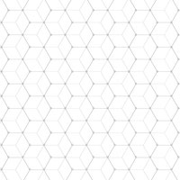
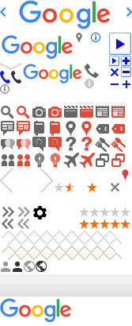

# Background

* [Background Color](#background-color)
* [Background Image](#background-image)
* [Background Image (Gradient)](#background-image-gradient)
* [Background Image (Multiple backgrounds)](#background-image-multiple-backgrounds)
* [Background Repeat](#background-repeat)
* [Background Position](#background-position)
* [Background Attachment](#background-attachment)
* [Background Size](#background-size)
* [Background Blend Mode](#background-blend-mode)
* [Background Shorthand](#background)
* [Filter](#filter)
* [Opacity](#opacity)

## [Background Color](https://developer.mozilla.org/en-US/docs/Web/CSS/background-color)
---

> <b>Value:</b> `<color>`

### Syntax

```css
/* Keyword values */
background-color: red;
background-color: indigo;

/* Hexadecimal value */
background-color: #bbff00;    /* Fully opaque */
background-color: #11ffee00;  /* Fully transparent */
background-color: #11ffeeff;  /* Fully opaque */

/* RGB value */
background-color: rgb(255, 255, 128);        /* Fully opaque */
background-color: rgba(117, 190, 218, 0.5);  /* 50% transparent */

/* Special keyword values */
background-color: currentcolor;
background-color: transparent;
```

### Example

```css
h1 {
  background-color: #000;
  color: #fff;
  padding: 20px;
}
```

<div style="border-radius: 0.3rem;background-color: #f3f6fa;border: solid 1px #dce6f0; padding: 0.8rem;">
  <h1 style="background-color: #000; color: #fff; padding: 20px;">Lorem ipsum dolor</h1>
</div>

## [Background Image](https://developer.mozilla.org/en-US/docs/Web/CSS/background-image)
---

> <b>Value:</b> none \| `<image>`

### Syntax

```css
background-image: url(img/image.jpg);
```

### Example

[img/hexagonal-pattern.jpg](bg-image/img/hexagonal-pattern.jpg) ([Source](https://www.freepik.com/free-vector/hexagonal-pattern_852781.htm#term=seamless%20pattern&page=1&position=2)):<br>


[bg-image/](bg-image/):
```css
h1 {
  background-image: url(img/hexagonal-pattern.jpg);
  padding: 20px;
}
```

Output:

<div style="border-radius: 0.3rem;background-color: #f3f6fa;border: solid 1px #dce6f0; padding: 0.8rem;">
  <h1 style="background-image: url(bg-image/img/hexagonal-pattern.jpg); padding: 20px;">Lorem ipsum dolor</h1>
</div>

### References
- [Unspalsh](https://unsplash.com)
- [Freepik](http://www.freepik.com/free-vectors/background)

## [Background Image (Gradient)](https://developer.mozilla.org/en-US/docs/Learn/CSS/Styling_boxes/Backgrounds#Background_image_gradients)
---

### Linear Gradient

[bg-image-linear-gradient/](bg-image-linear-gradient/):
```css
.bwbg {
  background-image: linear-gradient(#000, #fff);
}

.bwsidebg {
  background-image: linear-gradient(to right top, #000, #fff);
}

.greytranspbg {
  background-image: linear-gradient(45deg, rgba(0, 0, 0, .70), transparent);
}

.bluegreenbg {
  background-image: linear-gradient(45deg, rgba(0, 145, 200, .6), rgba(1, 193, 120, .6));
}
```

Output:

<div style="border-radius: 0.3rem;background-color: #f3f6fa;border: solid 1px #dce6f0; padding: 0.8rem;">
  <div style="height: 150px; width: 150px; margin: 1rem; display: inline-block; background-image: linear-gradient(#000, #fff);"></div>
  <div style="height: 150px; width: 150px; margin: 1rem; display: inline-block; background-image: linear-gradient(to right top, #000, #fff);"></div>
  <div style="height: 150px; width: 150px; margin: 1rem; display: inline-block; background-image: linear-gradient(45deg, rgba(0, 0, 0, .70), transparent);"></div>
  <div style="height: 150px; width: 150px; margin: 1rem; display: inline-block; background-image: linear-gradient(45deg, rgba(0, 145, 200, .6), rgba(1, 193, 120, .6));"></div>
</div>

### Radial Gradient

[bg-image-linear-gradient/](bg-image-linear-gradient/):
```css
.bwbg {
  background-image: radial-gradient(#000, #fff);
}

.bwsidebg {
  background-image: radial-gradient(circle at center, #000, #fff);
}

.greytranspbg {
  background-image: radial-gradient(circle at 10px 10px, rgba(0, 0, 0, .70), transparent);
}

.bluegreenbg {
  background-image: radial-gradient(farthest-corner at 40px 40px, rgba(0, 145, 200, .6), rgba(1, 193, 120, .6));
}
```

Output:

<div style="border-radius: 0.3rem;background-color: #f3f6fa;border: solid 1px #dce6f0; padding: 0.8rem;">
  <div style="height: 150px; width: 150px; margin: 1rem; display: inline-block; background-image: radial-gradient(#000, #fff);"></div>
  <div style="height: 150px; width: 150px; margin: 1rem; display: inline-block; background-image: radial-gradient(circle at center, #000, #fff);"></div>
  <div style="height: 150px; width: 150px; margin: 1rem; display: inline-block; background-image: radial-gradient(circle at 10px 10px, rgba(0, 0, 0, .70), transparent);"></div>
  <div style="height: 150px; width: 150px; margin: 1rem; display: inline-block; background-image: radial-gradient(farthest-corner at 40px 40px, rgba(0, 145, 200, .6), rgba(1, 193, 120, .6));"></div>
</div>

<!-- 
### Conic Gradient
https://css-tricks.com/snippets/css/css-conic-gradient/
https://css-tricks.com/1-element-css-rainbow-gradient-infinity/?utm_source=CSS-Weekly&utm_campaign=Issue-319&utm_medium=email
-->

### References
* [linear-gradient()](https://developer.mozilla.org/en-US/docs/Web/CSS/linear-gradient)
* [repeating-linear-gradient()](https://developer.mozilla.org/en-US/docs/Web/CSS/repeating-linear-gradient)
* [radial-gradient()](https://developer.mozilla.org/en-US/docs/Web/CSS/radial-gradient)
* [repeating-radial-gradient()](https://developer.mozilla.org/en-US/docs/Web/CSS/repeating-radial-gradient)
* [Radial Gradient Recipes](https://css-tricks.com/radial-gradient-recipes/)

## [Background Image (Multiple backgrounds)](https://developer.mozilla.org/en-US/docs/Learn/CSS/Styling_boxes/Backgrounds#Multiple_backgrounds)
---

[bg-image-multiple/](bg-image-multiple/):
```css
.multiple {
  background-image: linear-gradient(45deg, rgba(0, 0, 0, .70) 10%, transparent), url(img/image.jpg);
}

.trendbg {
  background-image: linear-gradient(45deg, rgba(0, 145, 200, .6), rgba(1, 193, 120, .6)), url(img/image.jpg);
}
```

Output:

<div style="border-radius: 0.3rem;background-color: #f3f6fa;border: solid 1px #dce6f0; padding: 0.8rem;">
  <div style="height: 150px; width: 150px; margin: 1rem; display: inline-block; background-image: url(bg-image-multiple/img/image.jpg); background-size: cover;"></div>
  <div style="height: 150px; width: 150px; margin: 1rem; display: inline-block; background-image: linear-gradient(45deg, rgba(0, 0, 0, .70) 10%, transparent), url(bg-image-multiple/img/image.jpg); background-size: cover;"></div>
  <div style="height: 150px; width: 150px; margin: 1rem; display: inline-block; background-image: linear-gradient(45deg, rgba(0, 145, 200, .6), rgba(1, 193, 120, .6)), url(bg-image-multiple/img/image.jpg); background-size: cover;"></div>
</div>

## [Background Repeat](https://developer.mozilla.org/en-US/docs/Web/CSS/background-repeat)
---

> <b>Value:</b> `<repeat-style>`<br>
> <br>
> `<repeat-style>`: repeat \| repeat-x \| repeat-y \| no-repeat

### Syntax

```css
/* Keyword values */
background-repeat: repeat-x;
background-repeat: repeat-y;
background-repeat: repeat;
background-repeat: no-repeat;
```

### Example

[img/pattern.png](bg-repeat/img/pattern.png) ([Source](https://www.freepik.com/free-vector/zig-zag-background-with-pastel-colors_1795073.htm)):<br>


[bg-repeat/](bg-repeat/):
```css
body {
  background-image: url(img/pattern.png);
  background-color: #fff;
  background-repeat: repeat;
}
```

Output:

<div style="border-radius: 0.3rem; background-color: #f3f6fa;border: solid 1px #dce6f0; padding: 0.8rem;">
  <div style="height: 200px; background-image: url(bg-repeat/img/pattern.png); background-color: #fff;"></div>
</div>

[bg-no-repeat/](bg-no-repeat/):
```css
body {
  background-image: url(img/pattern.png);
  background-color: #fff;
  background-repeat: no-repeat;
}
```

Output:

<div style="border-radius: 0.3rem; background-color: #f3f6fa;border: solid 1px #dce6f0; padding: 0.8rem;">
  <div style="height: 200px; background-image: url(bg-repeat/img/pattern.png); background-repeat: no-repeat; background-color: #fff;"></div>
</div>

### Reference

- [Continuous Background Graphics](https://www.freepik.com/index.php?goto=2&k=continuous-background&isCat=1&isKeyword=1&type=1&vars=1)
- [Continuos Background](https://www.shutterstock.com/search/continuous+background)
- [Seamless Pattern Graphics](https://www.freepik.com/free-photos-vectors/seamless-pattern)
- [Strip Generator](http://www.stripegenerator.com/)
- [Gradient](http://www.generateit.net/gradient/index.php)

## [Background Position](https://developer.mozilla.org/en-US/docs/Web/CSS/background-position)
---

> <b>Value:</b> `<bg-position>`

### Syntax

```css
/* Keyword values */
background-position: top;
background-position: bottom;
background-position: left;
background-position: right;
background-position: center;
background-position: center right;

/* <percentage> values */
background-position: 25% 75%;

/* <length> values */
background-position: 0 0;
background-position: 1cm 2cm;
background-position: 10ch 8em;

/* Edge offsets values */
background-position: bottom 10px right 20px;
background-position: right 3em bottom 10px;
```

### Example

[bg-position/](bg-position/) ([Source](https://developer.mozilla.org/en-US/docs/Learn/CSS/Styling_text/Styling_links#Including_icons_on_links)):
```css
a[href*="http"] {
  background-image: url('img/external-link-16.png');
  background-repeat: no-repeat;
  background-position: 100% 5px;
  padding-right: 19px;
}
```

Output:

<iframe src="bg-position/index.html" width="100%" style="border-radius: 0.3rem; background-color: #f3f6fa;border: solid 1px #dce6f0; padding: 0.8rem;"></iframe>

### Reference

* [CSS Sprites](https://css-tricks.com/css-sprites/)

## [Background Size](https://developer.mozilla.org/en-US/docs/Web/CSS/background-size)
---

> <b>Value:</b> contain \| cover \| auto \| `<length>` \| `<percentage>`

### Syntax

```css
/* Keyword values */
background-size: cover;
background-size: contain;

/* One-value syntax */
/* the width of the image (height becomes 'auto') */
background-size: 50%;
background-size: 3.2em;
background-size: 12px;
background-size: auto;

/* Two-value syntax */
/* first value: width of the image, second value: height */
background-size: 50% auto;
background-size: 3em 25%;
background-size: auto 6px;
background-size: auto auto;

/* Multiple backgrounds */
background-size: auto, auto; /* Not to be confused with `auto auto` */
background-size: 50%, 25%, 25%;
background-size: 6px, auto, contain;
```

### Example


```css
.auto {
  background-size: auto;
}

.size100 {
  background-size: 100px;
}

.cover {
  background-size: cover;
}

.contain {
  background-size: contain;
}
```

Output:

<div style="border-radius: 0.3rem; background-color: #f3f6fa;border: solid 1px #dce6f0; padding: 0.8rem;">
  <div style="width: 150px; height: 150px; display: inline-block; background-image: url(bg-size/img/image.jpg); background-size: auto;"></div>
  <div style="width: 150px; height: 150px; display: inline-block; background-image: url(bg-size/img/image.jpg); background-size: 100px;"></div>
  <div style="width: 150px; height: 150px; display: inline-block; background-image: url(bg-size/img/image.jpg); background-size: cover;"></div>
  <div style="width: 150px; height: 150px; display: inline-block; background-image: url(bg-size/img/image.jpg); background-size: contain;"></div>
</div>

## [Background Attachment](https://developer.mozilla.org/en-US/docs/Web/CSS/background-attachment)
---

> <b>Value:</b> fixed \| scrool \| local

### Syntax

```css
/* Keyword values */
background-attachment: scroll;
background-attachment: fixed;
background-attachment: local;
```

### Example

[bg-attachment/index.html](bg-attachment/)
```css
header {
  background-color: tomato;
  background-image: url(img/clock.jpg);
  background-position: 0 -100px;
  background-size: cover;
  background-repeat: no-repeat;
  background-attachment: fixed;
  background-blend-mode: multiply;
}
```

Output:

<iframe src="bg-attachment/index.html" width="100%" height="500px" style="border-radius: 0.3rem; background-color: #f3f6fa;border: solid 1px #dce6f0; padding: 0.8rem;"></iframe>

## [Background Blend Mode](https://developer.mozilla.org/en-US/docs/Web/CSS/background-blend-mode)
---

> <b>Value:</b> `<blend-mode>`<br>
> <br>
> `<blend-mode>` = normal \| multiply \| screen \| overlay \| darken \| lighten \| color-dodge \| color-burn \| hard-light \| soft-light \| difference \| exclusion \| hue \| saturation \| color \| luminosity

### Syntax

```css
/* One value */
background-blend-mode: normal;

/* Two values, one per background */
background-blend-mode: darken, luminosity;
```

### Example

[bg-blend-mode/](bg-blend-mode/):
```css
.bg {
  background-image: url(img/computer.jpg);
  background-size: cover;
  background-color: rgba(1, 193, 120, .9);
}

.normal {
  background-blend-mode: normal;
}

.multiply {
  background-blend-mode: multiply;
}

.screen {
  background-blend-mode: screen;
}

.overlay {
  background-blend-mode: overlay;
}

.darken {
  background-blend-mode: darken;
}

.lighten {
  background-blend-mode: lighten;
}
```

Output:

<div style="border-radius: 0.3rem; background-color: #f3f6fa;border: solid 1px #dce6f0; padding: 0.8rem;">
  <div style="width: 150px; height: 150px; display: inline-block; background-image: url(bg-blend-mode/img/computer.jpg); background-size: cover; background-blend-mode: normal; background-color: rgba(1, 193, 120, .9);"></div>
  <div style="width: 150px; height: 150px; display: inline-block; background-image: url(bg-blend-mode/img/computer.jpg); background-size: cover; background-blend-mode: multiply; background-color: rgba(1, 193, 120, .9);"></div>
  <div style="width: 150px; height: 150px; display: inline-block; background-image: url(bg-blend-mode/img/computer.jpg); background-size: cover; background-blend-mode: screen; background-color: rgba(1, 193, 120, .9);"></div>
  <div style="width: 150px; height: 150px; display: inline-block; background-image: url(bg-blend-mode/img/computer.jpg); background-size: cover; background-blend-mode: overlay; background-color: rgba(1, 193, 120, .9);"></div>
  <div style="width: 150px; height: 150px; display: inline-block; background-image: url(bg-blend-mode/img/computer.jpg); background-size: cover; background-blend-mode: darken; background-color: rgba(1, 193, 120, .9);"></div>
  <div style="width: 150px; height: 150px; display: inline-block; background-image: url(bg-blend-mode/img/computer.jpg); background-size: cover; background-blend-mode: lighten; background-color: rgba(1, 193, 120, .9);"></div>
</div>

### References

* [background-blend-mode \| CSS Tricks](https://css-tricks.com/almanac/properties/b/background-blend-mode/)

## [Background Shorthand](https://developer.mozilla.org/en-US/docs/Web/CSS/background)
---

> <b>Value:</b> [ `<bg-layer>` , ]* `<final-bg-layer>`<br>
> <br>
> `<bg-layer>` = `<bg-image>` || `<bg-position>` [ / `<bg-size>` ]? || `<repeat-style>` || `<attachment>` || `<box>` || `<box>`<br>
> `<final-bg-layer>` = `<background-color>` || `<bg-image>` || `<bg-position>` [ / `<bg-size>` ]? || `<repeat-style>` || `<attachment>` || `<box>` || `<box>`

### Syntax

```css
/* Using a <background-color> */
background: green;

/* Using a <bg-image> and <repeat-style> */
background: url("test.jpg") repeat-y;

/* Using a <box> and <background-color> */
background: border-box red;

/* A single image, centered and scaled */
background: no-repeat center/80% url("../img/image.png");
```

### Example Shorthand

```css
header {
  background-color: tomato;
  background-image: url(img/clock.jpg);
  background-position: 0 -100px;
  background-size: cover;
  background-repeat: no-repeat;
  background-attachment: fixed;
  background-blend-mode: multiply;
}
```

```css
header {
  background: tomato url(../img/clock.jpg) 0 -100px/cover no-repeat fixed;
  background-blend-mode: multiply; 
}
```

### Example Sprite



[sprite/](sprite/):
```css
.google {
  background: url(../img/google.png) no-repeat -24px 0;
  width: 116px;
  height: 37px;
}
```

References:
* [Sprite Cow](http://www.spritecow.com)
* [CSS Sprites](https://css-tricks.com/css-sprites/)

## [Filter](https://developer.mozilla.org/en-US/docs/Web/CSS/filter)
---

> <b>Value:</b> none \| [ `<filter-function>` \| `<url>` ]+<br>
> <br>
> `<filter-function>` = `<blur()`> \| `<brightness()`> \| `<contrast()`> \| `<drop-shadow()`> \| `<grayscale()`> \| `<hue-rotate()`> \| `<invert()`> \| `<opacity()`> \| `<saturate()`> \| `<sepia()`>

### Syntax

```css
/* URL to SVG filter */
filter: url("filters.svg#filter-id");

/* <filter-function> values */
filter: blur(5px);
filter: brightness(0.4);
filter: contrast(200%);
filter: drop-shadow(16px 16px 20px blue);
filter: grayscale(50%);
filter: hue-rotate(90deg);
filter: invert(75%);
filter: opacity(25%);
filter: saturate(30%);
filter: sepia(60%);

/* Multiple filters */
filter: contrast(175%) brightness(3%);
```

### Example

```css
.bg {
  background-image: url(img/computer.jpg);
  background-size: cover;
  background-color: rgba(1, 193, 120, .9);
}

.blur {
  filter: blur(5px);
}

.brightness {
  filter: brightness(0.4);
}

.contrast {
  filter: contrast(200%);
}

.grayscale {
  filter: grayscale(50%);
}

.sepia {
  filter: sepia(60%);
}
```

Output:

<div style="border-radius: 0.3rem; background-color: #f3f6fa;border: solid 1px #dce6f0; padding: 0.8rem;">
  <div style="width: 150px; height: 150px; display: inline-block; background-image: url(bg-blend-mode/img/computer.jpg); background-size: cover;"></div>
  <div style="width: 150px; height: 150px; display: inline-block; background-image: url(bg-blend-mode/img/computer.jpg); background-size: cover; filter: blur(5px);"></div>
  <div style="width: 150px; height: 150px; display: inline-block; background-image: url(bg-blend-mode/img/computer.jpg); background-size: cover; filter: brightness(0.4);"></div>
  <div style="width: 150px; height: 150px; display: inline-block; background-image: url(bg-blend-mode/img/computer.jpg); background-size: cover; filter: contrast(200%);"></div>
  <div style="width: 150px; height: 150px; display: inline-block; background-image: url(bg-blend-mode/img/computer.jpg); background-size: cover; filter: grayscale(50%);"></div>
  <div style="width: 150px; height: 150px; display: inline-block; background-image: url(bg-blend-mode/img/computer.jpg); background-size: cover; filter: sepia(90%);"></div>
</div>

## [Opacity](https://developer.mozilla.org/en-US/docs/Web/CSS/opacity)
---

> <b>Value:</b> `<number>`<br>
> <br>
> `<number>` (0..1)

### Syntax

```css
opacity: 0;
opacity: 0.33;
opacity: 1;
```

### Example

```css
img {
  opacity: .5;
}

img:hover {
  opacity: 1;
}
```

Output:

<iframe src="../opacity/image-opacity/index.html" width="100%" height="400px" style="border-radius: 0.3rem; background-color: #f3f6fa;border: solid 1px #dce6f0; padding: 0.8rem;"></iframe>

## References
---

* [Changing background styles using CSS \| MDN](https://developer.mozilla.org/en-US/docs/Learn/CSS/Styling_boxes/Backgrounds)
* [Advanced box effects \| MDN](https://developer.mozilla.org/en-US/docs/Learn/CSS/Styling_boxes/Advanced_box_effects )
* `background-clip`
  * [`background-clip`](https://developer.mozilla.org/en-US/docs/Web/CSS/background-clip)
  * [-webkit-background-clip:text CSS effect](https://codepen.io/Jintos/pen/crlxk)
* [`background-origin`](https://developer.mozilla.org/en-US/docs/Web/CSS/background-origin)

